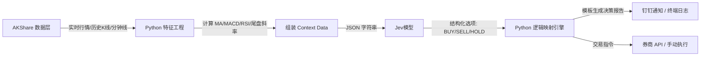

# 🤖 Fund Trading Bot (System One Edition)

> 基于 **TypeSafe System One (Jev)** 模型的基金尾盘自动化决策工具。
> **核心理念**：AI 只做绝对理性的结构化决策（0幻觉），代码负责严谨的数据获取与执行。

---

## 📖 项目简介

传统的量化交易工具依赖硬编码规则（如双均线交叉），难以处理复杂的市场状态；而传统大语言模型（LLM）又存在严重的“幻觉”问题，无法直接接入交易系统。

本项目引入了 **System One (Jev)** 模型。Jev 不生成文本，不写代码，只根据你喂给它的**实时行情、技术指标、资金流向**做“选择题”（买入/卖出/持有）。所有的决策逻辑均由 Python 代码通过模板生成，确保金融场景下 **100% 的合规性与可控性**。

### 🎯 适用场景
- **场内 ETF**：每日 14:50 获取实时行情与技术指标，判断次日溢价或趋势延续概率。
- **场外基金**：每日 14:50 获取实时估值，决定 15:00 前是否申购/赎回。

---

## ✨ 核心特性

- **🧠 System One 决策**：使用官方 `typesafe-sdk`，Jev 只输出 `BUY/SELL/HOLD` 等枚举值，绝不编造理由。
- **📊 多维数据融合**：整合日线指标（MA, MACD, RSI, ATR）、日内微观结构（尾盘斜率, VWAP, 量比）、资金流向与相对强弱。
- **🛡️ 无幻觉逻辑生成**：所有通知文案由 Python 规则引擎根据真实数据拼装，100% 可追溯。
- **🔄 自动重试机制**：AKShare 数据获取内置 3 次递增等待重试，确保 14:50 策略稳定运行。
- **🔔 灵活通知**：支持钉钉机器人推送，支持 `--no-notify` 纯日志模式。

---

## 🏗️ 系统架构



---

## 🚀 快速开始

### 1. 安装依赖
本项目使用 [`uv`](https://github.com/astral-sh/uv) 进行包管理，速度极快。

```bash
# 安装 uv (如果还没有)
curl -LsSf https://astral.sh/uv/install.sh | sh

# 进入项目目录
cd fund_trading_bot

# 同步依赖 (自动创建虚拟环境)
uv sync
```

### 2. 配置环境变量
复制示例文件并填入你的配置：

```bash
cp .env.example .env
```

编辑 `.env` 文件：

```env
# TypeSafe Jev 配置 (必填)
TYPESAFE_API_KEY=tsk_live_xxxxxxxxxxxxxxxxxxxxxxxx
JEV_MODE=api  # api=调用真实模型, mock=本地模拟测试

# 钉钉通知 (可选)
DINGTALK_WEBHOOK=https://oapi.dingtalk.com/robot/send?access_token=xxxx
DINGTALK_SECRET=SECxxxx
```

### 3. 运行

```bash
# 调试模式：立即执行一次，关闭通知
uv run python main.py --code 588000 --type etf --no-notify
```

---

## 💻 命令行使用指南

### 基础语法

```bash
uv run python main.py [选项]
```

### 参数说明

| 参数 | 说明 | 示例 |
|------|------|------|
| `--code` | 指定标的代码（支持多个） | `--code 588000 512010` |
| `--type` | 指定标的类型 | `--type etf` 或 `--type fund` |
| `--notify` | 开启通知（默认） | `--notify` |
| `--no-notify` | 关闭通知，仅输出日志 | `--no-notify` |
| `--daemon` | 定时模式，每天 14:50 自动执行 | `--daemon` |

### 实战案例

#### 案例 1：测试科创50ETF (588000)
```bash
uv run python main.py --code 588000 --type etf
```

#### 案例 2：测试医药ETF (512010) 并关闭通知
```bash
uv run python main.py --code 512010 --type etf --no-notify
```

#### 案例 3：批量监控多个 ETF
```bash
uv run python main.py --code 588000 512010 159929 --type etf
```

#### 案例 4：场外基金估值决策
```bash
uv run python main.py --code 011609 --type fund
```

#### 案例 5：部署为定时任务
```bash
uv run python main.py --daemon
```

---

## 📊 决策指标体系

Jev 的决策质量取决于你喂给它的数据。本项目在 14:50 时刻组装以下**立体化数据**：

### 1. 日线级别指标 (趋势与位置)
- **均线 (MA)**：5日、20日、60日，判断多空排列。
- **MACD**：DIF, DEA, 柱状图，判断动能。
- **RSI (14)**：判断超买 (>70) 或超卖 (<30)。
- **60日相对位置**：当前价格在近 60 日高低点之间的分位（0=最低点, 1=最高点）。
- **乖离率 (BIAS)**：偏离 20 日均线的程度，判断短期超买。
- **ATR (14)**：平均真实波幅，衡量近期波动风险。

### 2. 日内微观指标 (尾盘异动)
- **尾盘 20 分钟斜率**：14:30-14:50 的价格变化率，量化“抢筹”或“跳水”力度。
- **尾盘量比**：尾盘成交量 / 全天平均每分钟成交量，判断是否放量异动。
- **VWAP 偏离度**：当前价格相对日内均价的偏离，判断多空强弱。

### 3. 资金与相对强弱
- **主力净流入**：当日主力资金净买入金额。
- **相对大盘超额收益**：标的涨跌幅 - 上证指数涨跌幅，判断是否逆势走强。

---

## 📁 项目结构

```
fund_trading_bot/
├── pyproject.toml          # uv 项目配置
├── .env.example            # 环境变量模板
├── config/
│   └── settings.py         # 全局配置
├── data/
│   └── fetcher.py          # AKShare 数据获取 (含重试)
├── core/
│   ├── schema.py           # Jev 问题定义 (Choice, Noul)
│   ├── engine.py           # System One 决策引擎
│   └── executor.py         # 交易执行与逻辑生成
├── utils/
│   ├── indicators.py       # 技术指标计算
│   ├── logic_generator.py  # 决策逻辑文本生成器
│   └── notifier.py         # 钉钉通知
├── tests/
│   └── test_bot.py         # 单元测试
├── main.py                 # 主入口
└── README.md
```

---

## 🧪 测试指南

使用 `pytest` 运行测试：

```bash
# 运行所有测试
uv run pytest tests/ -v

# 只测试数据获取与重试机制
uv run pytest tests/test_bot.py::TestDataFetcher -v

# 只测试 Jev SDK 调用与解析
uv run pytest tests/test_bot.py::TestJevEngineSDK -v

# 查看测试覆盖率
uv run pytest tests/ --cov=data --cov=core --cov-report=term-missing
```

---

## 🚀 生产部署

### 使用 Systemd (Linux)

创建服务文件 `/etc/systemd/system/fund-bot.service`：

```ini
[Unit]
Description=Fund Trading Bot (System One)
After=network.target

[Service]
Type=simple
User=ubuntu
WorkingDirectory=/home/ubuntu/fund_trading_bot
ExecStart=/home/ubuntu/.local/bin/uv run python main.py --daemon --notify
Restart=always
RestartSec=10

[Install]
WantedBy=multi-user.target
```

启动服务：

```bash
sudo systemctl daemon-reload
sudo systemctl enable fund-bot
sudo systemctl start fund-bot
```

### 使用 Docker

```dockerfile
FROM ghcr.io/astral-sh/uv:python3.12-bookworm-slim

WORKDIR /app

# 先复制依赖文件，利用缓存
COPY pyproject.toml uv.lock ./
RUN uv sync --frozen --no-install-project

# 复制源码
COPY . .
RUN uv sync --frozen

# 运行
CMD ["uv", "run", "python", "main.py", "--daemon"]
```

构建并运行：

```bash
docker build -t fund-bot .
docker run -d --env-file .env --name fund-bot fund-bot
```

---

## ❓ 常见问题 (FAQ)

### Q1: Jev 能自己获取行情数据吗？
**不能。** System One 模型是纯决策模型，它不联网、不调用 API。所有数据必须由你的 Python 脚本（AKShare）获取并组装成 JSON 喂给它。

### Q2: 为什么通知里的“决策逻辑”不是 Jev 写的？
因为 Jev 的核心设计是**不生成自由文本**，以避免幻觉。所有的逻辑文案都是由 `utils/logic_generator.py` 根据真实数据和预设模板生成的，确保 100% 准确。

### Q3: 支持股票交易吗？
本项目专为**基金（ETF/场外基金）**设计。如果需要支持股票，需要扩展 `DataFetcher` 增加 `ak.stock_zh_a_spot_em()` 接口，并新增对应的 `STOCK_QUESTIONS`。

### Q4: 14:50 获取的数据准确吗？
AKShare 的数据来自东方财富等公开接口，有 1-3 秒延迟。对于日线级别的尾盘决策，这个精度完全足够。场外基金的“估算净值”与最终净值误差通常在 0.1% 以内。

---

## ⚠️ 免责声明

- 本项目仅供**学习、研究和参考**，不构成任何投资建议。
- 量化交易存在风险，AI 决策不能保证 100% 盈利。
- 请务必在充分测试和理解代码逻辑后，再考虑接入真实交易接口。
- 作者不对因使用本项目产生的任何损失承担责任。
